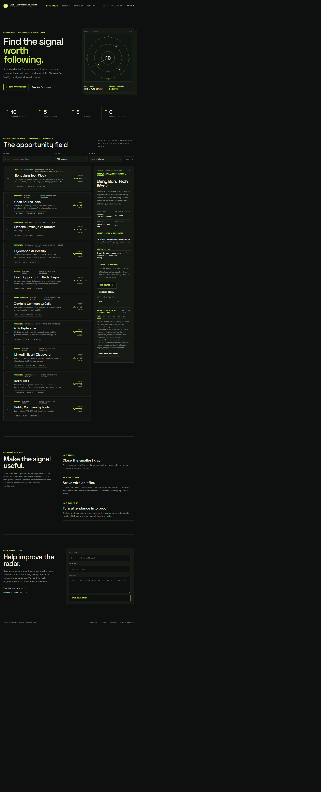

# Event Opportunity Radar

> An evidence-aware event intelligence platform that turns noisy event discovery into verified dates, realistic contribution paths, application guidance, and follow-through.

[](https://pavan755.github.io/event-opportunity-radar/)
[](tools/run-ci-quality-gate.js)
[](.github/workflows/deploy-pages.yml)
[](LICENSE)

### Project controls

[Open the app](https://pavan755.github.io/event-opportunity-radar/) ·
[Browse source](https://github.com/Pavan755/event-opportunity-radar) ·
[Issues](https://github.com/Pavan755/event-opportunity-radar/issues) ·
[Actions](https://github.com/Pavan755/event-opportunity-radar/actions) ·
[Deployments](https://github.com/Pavan755/event-opportunity-radar/deployments) ·
[Releases](https://github.com/Pavan755/event-opportunity-radar/releases) ·
[Contributors](https://github.com/Pavan755/event-opportunity-radar/graphs/contributors)

## Live App

**https://pavan755.github.io/event-opportunity-radar/**

The app is the primary public interface: a retro-futurist radar for discovering signals, checking evidence, choosing a contribution path, preparing an application, bookmarking a signal, and tracking lifecycle progress.

## About

Event Opportunity Radar exists because finding an event is not the same as finding a useful opportunity. A useful opportunity has a trustworthy source, a clear event window, a realistic way to participate, a contact or application path, and a sensible next action.

The platform is designed for learners, volunteers, contributors, students, community builders, and early-career professionals who want to move from:

```text
Discover -> Verify -> Understand -> Choose a path -> Act -> Follow up
```

The system distinguishes source-backed facts from predictions. A predicted role, date, or next step is labelled as such and should be confirmed with the organizer.

## What Users Can Do

1. Open the [Live App](https://pavan755.github.io/event-opportunity-radar/).
2. Scan the signal field and search by event, organizer, skill, or category.
3. Filter by region and evidence status.
4. Select a signal to inspect dates, deadline, source, contacts, application routes, and predicted contribution paths.
5. Choose one of six locally generated prompts and copy it into ChatGPT, Gemini, Claude, or another GPT tool.
6. Change the lifecycle state directly, including returning to an earlier state when the situation changes.
7. Bookmark signals in the browser for repeat review.
8. Use the contact form to open Gmail Compose with the project address, subject, reply email, and message context filled in.

Detailed navigation: [docs/user-guide.md](docs/user-guide.md)

## Features

- **Evidence-aware discovery:** source policy covers official, community, GitHub, event-platform, social, and secondary sources.
- **Action intelligence:** event windows, application deadlines, contact channels, possible roles, strategy steps, and next actions.
- **Fact/prediction separation:** dates and roles are marked as verified, predicted, or unknown.
- **Prompt guidance:** six precise, free, local prompts are generated per signal without sending user data to an AI API.
- **Lifecycle follow-through:** new, considering, planned, registered, accepted, attended, follow-up, contribution, documented, dismissed, cancelled, and withdrawn.
- **Bookmarks:** selected signals persist locally in the browser.
- **Automated refresh:** the public discovery artifact refreshes twice daily at 08:00 and 20:00 India time, plus manual dispatch.
- **Deterministic verification:** focused regression suites run through one quality gate.

## Architecture

```mermaid
flowchart LR
  A[Configured Sources] --> B[Health + Policy Gate]
  B --> C[Query Planner]
  C --> D[Plan Validation + Deduplication]
  D --> E[Source Adapters]
  E --> F[Result Validation]
  F --> G[Record Normalization]
  G --> H[Evidence + Authority Policy]
  H --> I[Canonical Identity]
  I --> J[Action Intelligence]
  J --> K[Dates + Routes + Roles]
  K --> L[Strategies + GPT Prompts]
  L --> M[Lifecycle + Bookmarks]
  M --> N[Angular Radar UI]
```



| Boundary | Responsibility | Main location |
| --- | --- | --- |
| Discovery | Select sources, plan queries, execute adapters | `apps-script/src/Discovery*.gs` |
| Trust | Evidence records and authority policy | `apps-script/src/*Evidence*.gs` |
| Identity | Stable discovery and opportunity IDs | `apps-script/src/OpportunityIdentity.gs` |
| Action intelligence | Dates, routes, roles, contacts, predictions, prompts | `apps-script/src/OpportunityActionIntelligence.gs` |
| Lifecycle | User progression and durable state model | `apps-script/src/OpportunityLifecycle*.gs` |
| Publication | Production projection and Google Sheet snapshot | `apps-script/src/OpportunityRadarProductionEntry.gs` |
| UI | Public responsive radar experience | `ui/src/app` |

Full architecture: [docs/architecture.md](docs/architecture.md)

## Tech Stack

- **Frontend:** Angular 20, TypeScript, standalone components, responsive CSS.
- **Backend orchestration:** Google Apps Script-compatible JavaScript modules.
- **Discovery worker:** Node.js 20 Event Agent Lite.
- **Data:** JSON configuration and generated public discovery artifact.
- **Persistence:** Google Sheets adapters for production lifecycle and radar snapshots; browser storage for public bookmarks and local lifecycle interaction.
- **Automation:** GitHub Actions for quality, discovery refresh, and Pages deployment.
- **Hosting:** GitHub Pages.
- **Prompt generation:** deterministic local templates; no paid AI service is required.

## Getting Started

### Prerequisites

- Git
- Node.js 20 or newer
- npm
- A modern browser

### Clone and run the UI

```bash
git clone https://github.com/Pavan755/event-opportunity-radar.git
cd event-opportunity-radar
npm ci --prefix ui
npm start --prefix ui
```

Open `http://localhost:4200/`.

### Build the deployment artifact

```bash
npm run build --prefix ui -- --base-href /event-opportunity-radar/
```

The deployable site is written to `ui/dist/ui/browser/`.

### Run the quality gate

```bash
node tools/run-ci-quality-gate.js
```

### Refresh discovery data locally

```bash
node tools/run-event-agent-lite.js
```

This fetches configured public sources and writes `data/event-agent-lite.json`. Network results can change; never treat a generated prediction as verified without checking its source.

## Backend Usage

The Apps Script production entrypoint accepts injected configuration and adapters:

```javascript
runProductionOpportunityRadarJob({
  queries,
  sources,
  healthRecords,
  adapters,
  policy,
  publisher
});
```

The action-intelligence pipeline returns records containing public-facing groups:

```json
{
  "discovery_id": "source:record",
  "title": "Example event",
  "event_start_date": "September 1, 2026",
  "event_end_date": "September 6, 2026",
  "application_deadline": null,
  "verification_status": "needs_manual_verification",
  "action_intelligence": {
    "roles": [],
    "application_options": [],
    "contacts": {},
    "strategy": [],
    "prompts": [],
    "predictions": {}
  }
}
```

Contract details: [docs/api-contracts.md](docs/api-contracts.md)

## Project Structure

```text
.
├── .github/workflows/          # Quality gate, discovery refresh, Pages deployment
├── apps-script/src/            # Discovery, evidence, identity, action, lifecycle modules
├── config/                     # Sources, queries, locations, policy, skills
├── data/                       # Public generated discovery artifact and fixtures
├── docs/                       # Architecture, user guide, contracts, workflows
├── tools/                      # Deterministic local runners and regression tests
├── ui/                         # Sole public Angular application
│   ├── src/app/app.html       # Main product surface
│   ├── src/app/app.ts         # UI state and interactions
│   ├── src/app/app.css        # Retro-futurist visual system
│   └── src/app/core/          # Models and services
├── SECURITY.md
├── CONTRIBUTING.md
└── README.md
```

## Automation and Deployment

- [Quality gate](.github/workflows/quality-gate.yml): deterministic regression checks.
- [Event Agent Lite](.github/workflows/event-agent-lite.yml): refreshes public data twice daily.
- [GitHub Pages](.github/workflows/deploy-pages.yml): builds `ui` and publishes `ui/dist/ui/browser`.

To deploy manually:

1. Push changes to `main`, or open GitHub Actions.
2. Run **Deploy static site to GitHub Pages** with **Run workflow**.
3. Confirm repository Settings -> Pages uses **GitHub Actions**.
4. Open the deployment URL shown in the `github-pages` environment.

Repository operations guide: [docs/github-project-guide.md](docs/github-project-guide.md)

## Visual Documentation

- [Open the live radar](https://pavan755.github.io/event-opportunity-radar/)
- [User navigation guide](docs/user-guide.md)
- [Visual and screenshot guide](docs/visual-guide.md)




The UI is one responsive page organized as: identity and radar console, signal metrics, opportunity field, inspect panel, strategy protocol, and contact transmission.

## Technical Decisions

- **JSON and deterministic runners:** inspectable and reproducible without a database or paid API dependency.
- **Facts and predictions are separate:** event pages frequently omit volunteer roles, deadlines, or end dates, so guesses must be labelled.
- **Local prompt generation:** useful prompts without sending private form data or requiring an API key.
- **Google Sheets adapters:** practical Apps Script persistence while private workflow data stays separate from the public repository.
- **Angular Pages deployment:** a stable static artifact built and published by a repeatable workflow.

## Security and Privacy

- Do not commit API keys, Gmail credentials, Apps Script secrets, or private contact notes.
- The public contact form opens a Gmail Compose URL; it does not send mail automatically or receive Gmail credentials.
- Social and aggregator sources are discovery leads, not automatic verification.
- Read [SECURITY.md](SECURITY.md) before reporting a vulnerability.

## References and Credits

This project is original repository code built with and documented using these public technologies and references:

- [Angular documentation](https://angular.dev/): frontend framework and build tooling.
- [TypeScript documentation](https://www.typescriptlang.org/docs/): frontend language and type contracts.
- [Google Apps Script documentation](https://developers.google.com/apps-script): backend runtime and Sheets integration model.
- [GitHub Actions documentation](https://docs.github.com/actions): quality, refresh, and deployment workflows.
- [GitHub Pages documentation](https://docs.github.com/pages): static hosting and deployment model.
- [Mermaid documentation](https://mermaid.js.org/): architecture and workflow diagrams.
- [Google Fonts](https://fonts.google.com/): `Space Grotesk` and `DM Mono` typography used by the UI.

No external application code was copied into the product. Source links, event metadata, and organizer references remain subject to their original publishers' terms and are treated as evidence inputs, not ownership claims.

## Contributing

Read [CONTRIBUTING.md](CONTRIBUTING.md), run the quality gate, and keep changes focused on one boundary. New sources should include policy metadata and deterministic tests where possible.

## License

[MIT License](LICENSE)
