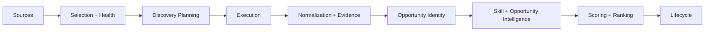

# Event Opportunity Radar

Event Opportunity Radar is an evidence-aware opportunity intelligence system.

It is designed to help you move from noisy discovery to practical action:

Discover -> Verify -> Understand -> Score -> Rank -> Act

## What this project solves

Most tools answer one question:

- What events exist?

This project is focused on a harder and more useful question:

- Which opportunities are worth my attention based on trust, relevance, and expected value?

## Core differentiators

- Multi-source discovery across heterogeneous channels.
- Policy-aware evidence and verification context.
- Canonical identity model that separates discovery_id from opportunity_id.
- Personal skill intelligence for relevance-aware ranking.
- Deterministic scoring and ranking pipeline.
- Lifecycle foundation for follow-through after discovery.

## Architecture at a glance



Detailed architecture: [docs/architecture.md](docs/architecture.md)

## Repository structure

- [apps-script/src](apps-script/src): Apps Script modules for discovery, intelligence, scoring, and lifecycle.
- [config](config): Source, scoring, query, location, and skill configuration.
- [tools](tools): Local deterministic test and regression runners.
- [data](data): Fixtures and generated artifacts.
- [dashboard](dashboard): Static dashboard assets.
- [docs](docs): Architecture, workflows, scoring, verification, and context docs.

## Quality gate and CI

The repository includes a deterministic regression quality gate.

- CI workflow: [.github/workflows/quality-gate.yml](.github/workflows/quality-gate.yml)
- Local runner: [tools/run-ci-quality-gate.js](tools/run-ci-quality-gate.js)

Run locally:

```bash
node tools/run-ci-quality-gate.js
```

## Local development quickstart

1. Clone the repository.
2. Run targeted local regression suites from [tools](tools).
3. Start with the consolidated quality gate.
4. Validate focused modules when changing specific behavior.

Examples:

```bash
node tools/run-ci-quality-gate.js
node tools/run-opportunity-radar-pipeline-test.js
node tools/run-opportunity-lifecycle-test.js
```

## Documentation index

- Product context: [docs/project-context.md](docs/project-context.md)
- Architecture: [docs/architecture.md](docs/architecture.md)
- Workflows: [docs/workflows.md](docs/workflows.md)
- Verification: [docs/verification.md](docs/verification.md)
- Scoring: [docs/scoring.md](docs/scoring.md)
- Agent lite notes: [docs/agent-lite.md](docs/agent-lite.md)

## Modernization roadmap

Current priority order:

1. CI quality enforcement and deterministic regressions.
2. Boundary contract hardening with shared JSDoc typedefs.
3. Security hardening and least-privilege workflow controls.
4. Persistence and lifecycle integration for complete user workflows.
5. Dashboard and action surfaces for discover-to-action execution.

## About the maintainer

This project is maintained by the repository owner and community contributors.

The product direction is practical opportunity intelligence: identify meaningful opportunities early, validate trust signals, rank personal relevance, and support real follow-through.

Repository home: [GitHub repository](https://github.com/Pavan755/event-opportunity-radar)

## Contributing

Contribution guidelines: [CONTRIBUTING.md](CONTRIBUTING.md)

## Security

Security policy and reporting process: [SECURITY.md](SECURITY.md)

## License

License details: [LICENSE](LICENSE)
