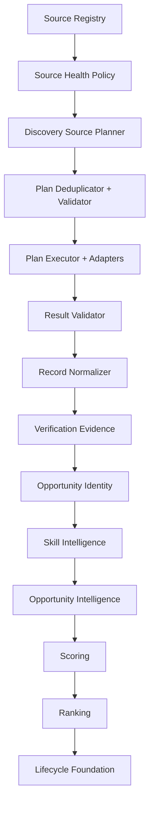

# Event Opportunity Radar Architecture

## System goal

Event Opportunity Radar is an opportunity intelligence pipeline.

It discovers opportunity signals from multiple sources, applies trust-aware verification, creates canonical identities, enriches records with intelligence, scores and ranks outcomes, and supports lifecycle follow-through.

## End-to-end pipeline

## Architecture boundaries

- Discovery boundary:
Source selection, planning, execution, and normalization.

- Trust boundary:
Verification evidence and policy-aware authority handling.

- Identity boundary:
Stable canonical mapping from discovery_id to opportunity_id.

- Intelligence boundary:
Skill and opportunity-context enrichment.

- Decision boundary:
Action intelligence without numeric scoring: event windows, routes, roles,
contacts, strategy, predictions, and guidance prompts.

- Action boundary:
Lifecycle states and follow-through operations.

- Publication boundary:
The production entrypoint projects ranked records into a stable dashboard row
contract and can replace the durable `Opportunity Radar` sheet snapshot.

## Canonical data contracts

These should be treated as stable boundary contracts and progressively formalized with shared JSDoc typedefs:

- DiscoveryRecord
- EvidenceRecord
- OpportunityIdentityRecord
- SkillIntelligenceRecord
- OpportunityIntelligenceRecord
- OpportunityScoreRecord
- OpportunityLifecycleRecord
- OpportunityRadarResult

## Why this model scales

- Adapter independence allows source expansion without scoring rewrites.
- Evidence-aware records improve ranking trust and explainability.
- Canonical identity reduces duplicate tracking and fragmented history.
- Deterministic scoring keeps behavior testable and regression-safe.
- Lifecycle foundation aligns discovery with measurable outcomes.

## Current modernization focus

1. Enforce deterministic quality gates in CI.
2. Harden module boundary contracts.
3. Strengthen security controls and workflow permissions.
4. Complete persistence and lifecycle integration.
5. Expand dashboard and action surfaces.

The production orchestration boundary is now available through
`runProductionOpportunityRadarJob(config)`. It accepts injected configuration
and adapters so scheduled Apps Script jobs can run the canonical pipeline
without moving source credentials or policy into the scoring modules.

The public production projection is score-free. Every date, role, or next-step
recommendation is either a source-backed fact or explicitly labelled as a
prediction with confidence and basis. The lightweight public updater runs twice
daily at 08:00 and 20:00 India time when GitHub Actions is enabled.
