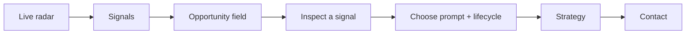

# User Guide

> A visual walkthrough of the deployed radar. Start with the desktop or mobile preview, then follow the numbered navigation path.

[Open the live app](https://pavan755.github.io/event-opportunity-radar/) · [Desktop screenshot](screenshots/01-radar-desktop.png) · [Mobile screenshot](screenshots/02-radar-mobile.png)

## Navigation at a glance




## 1. Open the Radar

Use the live app: [pavan755.github.io/event-opportunity-radar](https://pavan755.github.io/event-opportunity-radar/).

The header shows the product name, navigation anchors, local device time, and node status.

## 2. Read the Signal Console

The radar console gives a visual overview of the current public artifact. The metric strip shows:

- tracked events
- action routes
- verified sources
- remote or hybrid signals

These are operational counts, not quality scores.

The top navigation anchors are interactive: **Live radar** returns to the hero, **Signals** jumps to the metrics and opportunity field, **Strategy** opens the operating protocol, and **Contact** opens the suggestion form.

## 3. Find a Signal

Use the opportunity field to:

- search by event, organizer, category, or skill
- filter by region
- filter by evidence status
- select a signal for inspection

## 4. Inspect a Signal

The inspection panel contains:

- event start and end dates
- application deadline, when found
- organizer
- evidence status
- likely contribution paths, labelled as predicted
- verified and predicted application routes
- contact channels
- lifecycle state
- six generated prompts

Unknown values are intentionally shown as unknown. Confirm them on the source page before acting.

The inspect panel is the main decision surface. Use it in this order:

1. Confirm the source and evidence label.
2. Read the event window and application deadline.
3. Review predicted contribution paths.
4. Choose a verified application route or organizer contact route.
5. Select a lifecycle state and bookmark the signal.

## 5. Use the Prompt Set

Select prompt `01` through `06`:

1. Apply clearly
2. Contact the organizer
3. Choose a role
4. Prepare for the event
5. Verify before acting
6. Follow up well

Use **Copy selected prompt**, then paste it into the GPT tool you already use. The prompts instruct the tool not to invent dates, roles, benefits, experience, or attendance.

## 6. Choose a Lifecycle State

The lifecycle selector exposes every available state:

```text
NEW
CONSIDERING
PLANNED
REGISTERED
ACCEPTED
ATTENDED
FOLLOW_UP
CONTRIBUTION
DOCUMENTED
DISMISSED
CANCELLED
WITHDRAWN
```

The selected state is saved in browser storage. This is personal workflow state and is not sent to the public data artifact.

## 7. Bookmark a Signal

Use **Bookmark signal** to save a signal in the current browser. Bookmarks are local to that browser profile. They are not a public claim and are not synchronized across devices.

## 8. Send a Suggestion

At the bottom of the page:

1. Enter your name.
2. Enter your reply email.
3. Write a suggestion, correction, contribution idea, or source lead.
4. Select **Open Gmail compose**.

The app opens Gmail Compose addressed to `bandarupavan282004@gmail.com` with the subject, sender reply email, and message context filled in. You still review and send the email yourself.

## Feature checklist

| Feature | Where to find it | What it does |
| --- | --- | --- |
| Live scan | Hero | Jumps to the opportunity field |
| Search | Opportunity field | Finds events, skills, categories, and organizers |
| Region filter | Opportunity field | Narrows signals by location |
| Evidence filter | Opportunity field | Separates verified candidates from review-needed signals |
| Inspect panel | Select a card | Shows dates, routes, roles, contacts, and guidance |
| Prompt chooser | Inspect panel | Selects one of six copyable GPT prompts |
| Lifecycle selector | Inspect panel | Chooses any current workflow state |
| Bookmark | Inspect panel | Saves a signal in the current browser |
| Strategy | Bottom protocol section | Explains learn, contribute, and follow-up actions |
| Contact | Bottom form | Opens Gmail Compose with structured context |
