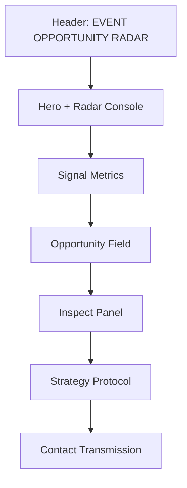

# Visual and Screenshot Guide

## Visual language

The interface uses a retro-futurist instrument-panel direction:

- near-black green background
- lime signal accent
- amber secondary signal
- mono labels for system metadata
- expressive display type for section titles
- thin technical borders and square controls
- radar rings and sweep motion as the primary visual motif

## Page map

## Navigation map

| Screen area | Anchor | Main user action |
| --- | --- | --- |
| Hero | `#radar` | Scan opportunities |
| Metrics | `#signals` | Understand the current public feed |
| Opportunity field | `#opportunity-heading` | Search, filter, and select signals |
| Strategy | `#strategy` | Learn how to turn a signal into action |
| Contact | `#contact` | Send a suggestion through Gmail Compose |

## Responsive behavior

- Desktop: two-column hero, signal strip, list plus sticky inspection panel.
- Tablet: stacked hero console and single-column inspection flow.
- Mobile: compact header, single-column cards, full-width controls, and no horizontal overflow.

## Visual verification checklist

Use the live app directly when reviewing the interface. The repository intentionally does not embed screenshots because GitHub scales long page captures inconsistently.

1. Open the [live app](https://pavan755.github.io/event-opportunity-radar/).
2. Check the hero and radar console at desktop width.
3. Check the opportunity field with one signal selected.
4. Check the prompt chooser and lifecycle selector.
5. Check the contact form with the Gmail Compose action visible.
6. Repeat the check at a mobile width.
