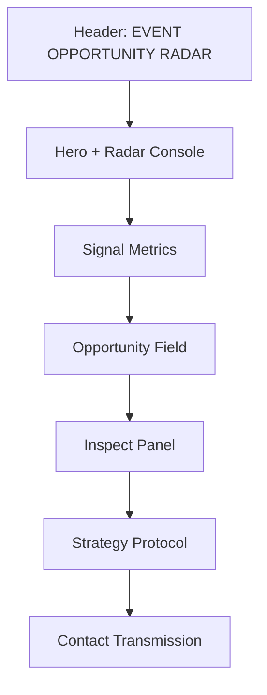

# Visual and Screenshot Guide

## Visual language

The interface uses a retro-futurist instrument-panel direction:

- near-black green background
- lime signal accent
- amber secondary signal
- mono labels for system metadata
- expressive display type for section titles
- thin technical borders and square controls
- radar rings and sweep motion as the primary visual motif

## Page map



## Navigation map

| Screen area | Anchor | Main user action |
| --- | --- | --- |
| Hero | `#radar` | Scan opportunities |
| Metrics | `#signals` | Understand the current public feed |
| Opportunity field | `#opportunity-heading` | Search, filter, and select signals |
| Strategy | `#strategy` | Learn how to turn a signal into action |
| Contact | `#contact` | Send a suggestion through Gmail Compose |

## Responsive behavior

- Desktop: two-column hero, signal strip, list plus sticky inspection panel.
- Tablet: stacked hero console and single-column inspection flow.
- Mobile: compact header, single-column cards, full-width controls, and no horizontal overflow.

## Screenshot capture checklist

The repository includes clean, data-only navigation screenshots generated from the local app:

- [Desktop radar](screenshots/01-radar-desktop.png)
- [Mobile radar](screenshots/02-radar-mobile.png)

Refresh them from the deployed app when the visual system changes:

1. Open the [live app](https://pavan755.github.io/event-opportunity-radar/).
2. Capture the hero and radar console at desktop width.
3. Capture the opportunity field with one signal selected.
4. Capture the prompt chooser and lifecycle selector.
5. Capture the contact form with the Gmail Compose action visible.
6. Repeat the hero and opportunity field at a mobile width.

Keep these filenames stable so README and guide links remain valid:

```text
docs/screenshots/01-hero-radar-desktop.png
docs/screenshots/02-opportunity-field-desktop.png
docs/screenshots/03-inspect-panel-prompts.png
docs/screenshots/04-contact-form.png
docs/screenshots/05-radar-mobile.png
```

Do not add screenshots containing private email content, browser profile details, tokens, or personal lifecycle notes.
