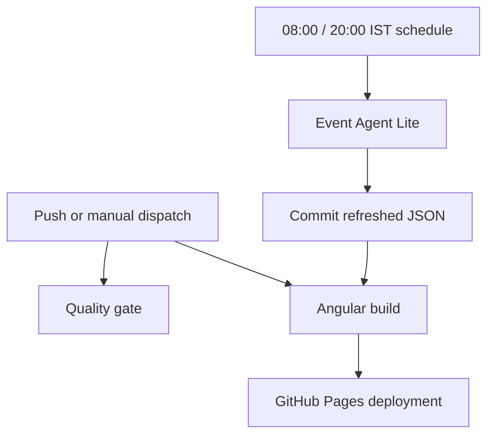

# Repository Workflows

## Workflow map



## Workflow goals

- Enforce deterministic validation on pull requests and pushes.
- Keep scheduled automation separate from quality enforcement.
- Use least-privilege permissions for each workflow.

## Active workflows

### quality-gate.yml

Location: [.github/workflows/quality-gate.yml](../.github/workflows/quality-gate.yml)

- Trigger:
Push to main, pull request to main, and manual dispatch.
- Purpose:
Run deterministic local regression suites through [tools/run-ci-quality-gate.js](../tools/run-ci-quality-gate.js).
- Permissions:
contents: read.

### event-agent-lite.yml

Location: [.github/workflows/event-agent-lite.yml](../.github/workflows/event-agent-lite.yml)

- Trigger:
Twice-daily schedule at 08:00 and 20:00 India time, plus manual dispatch.
- Purpose:
Run event-agent-lite process and commit updated data artifact.
- Permissions:
contents: write (required for repository commit).

### deploy-pages.yml

Location: [.github/workflows/deploy-pages.yml](../.github/workflows/deploy-pages.yml)

- Trigger:
Push to main and manual dispatch.
- Purpose:
Deploy static site artifacts to GitHub Pages.
- Permissions:
contents: read, pages: write, id-token: write.

## Local and CI parity

Run the same deterministic gate locally before opening a pull request:

```bash
node tools/run-ci-quality-gate.js
```

Run focused suites for specific module work:

```bash
node tools/run-opportunity-radar-pipeline-test.js
node tools/run-opportunity-scoring-integration-test.js
```

## Operational guidance

- Keep unstable network-heavy checks out of required PR gates.
- Add only deterministic suites to [tools/run-ci-quality-gate.js](../tools/run-ci-quality-gate.js).
- Use workflow-specific permissions instead of broad defaults.

## Interactive GitHub surfaces

- [Actions](https://github.com/Pavan755/event-opportunity-radar/actions): inspect runs, logs, and manual dispatch buttons.
- [Deployments](https://github.com/Pavan755/event-opportunity-radar/deployments): open the latest `github-pages` environment URL.
- [Releases](https://github.com/Pavan755/event-opportunity-radar/releases): create a tagged public milestone when a version is ready.
- [Issues](https://github.com/Pavan755/event-opportunity-radar/issues): report a source correction or suggest an opportunity.
- [Contributors](https://github.com/Pavan755/event-opportunity-radar/graphs/contributors): see project participation.
